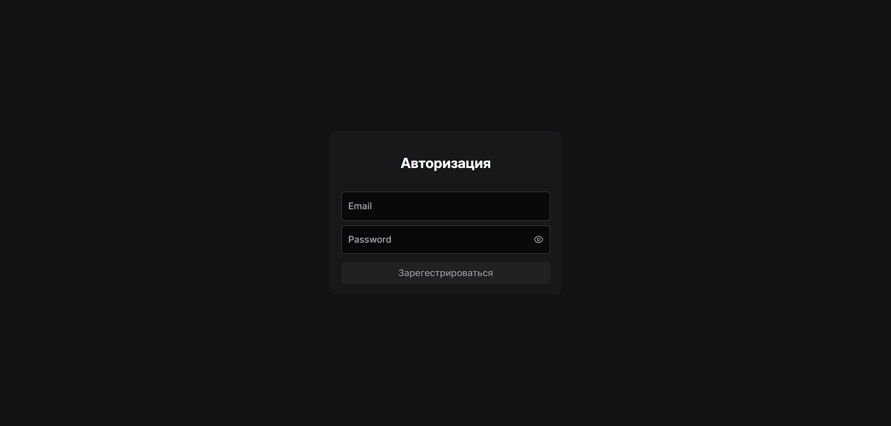
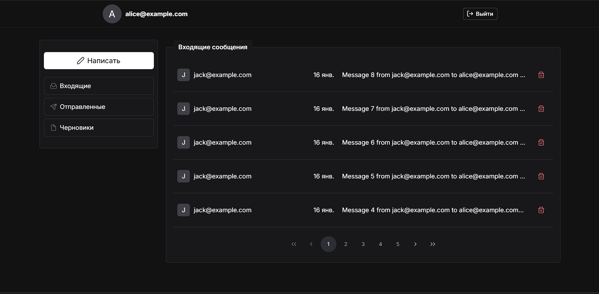
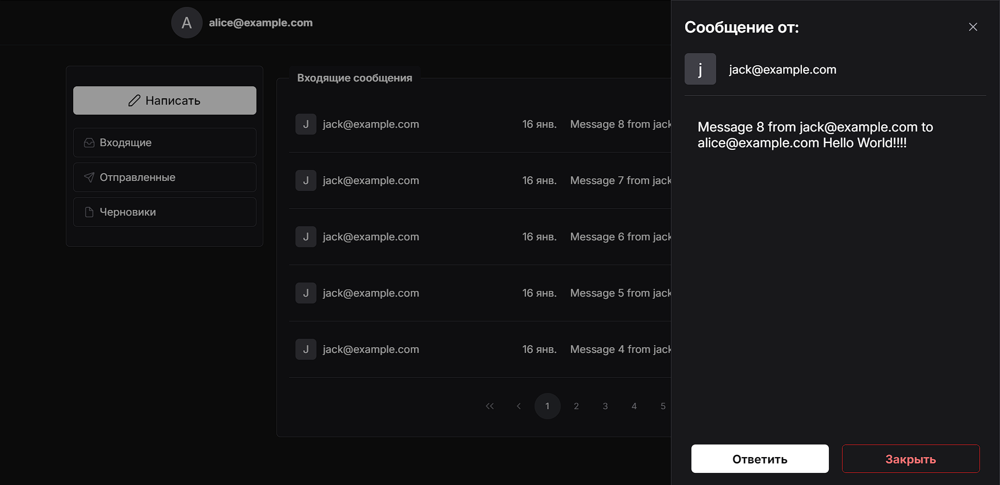
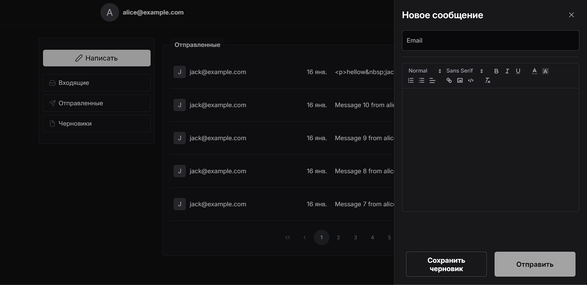
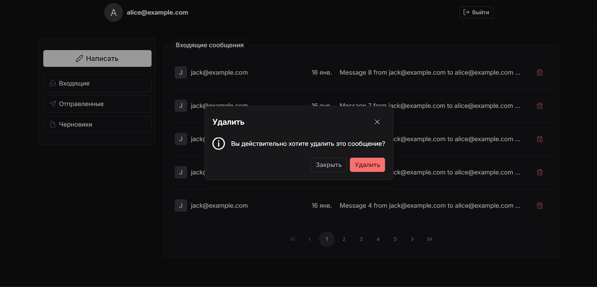
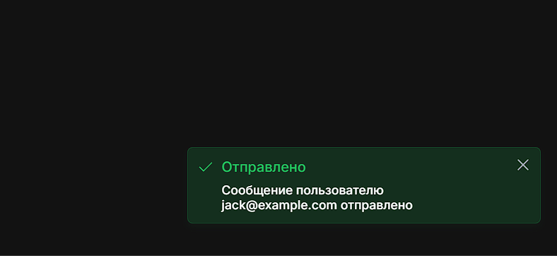

# TestInfotexApp

This project was generated using [Angular CLI](https://github.com/angular/angular-cli) version 19.0.7.

## Development server

To start a local development server, run:

```bash
git clone https://github.com/Kneepy/test_infotecs_app.git
npm i
npm run start
```

Once the server is running, open your browser and navigate to `http://localhost:4200/`.

## Building

To build the project run:

```bash
npm run build
```

This will compile your project and store the build artifacts in the `dist/` directory. By default, the production build optimizes your application for performance and speed.

## Test Users

| Почта      | Пароль     |
|------------|------------|
| alice@example.com  | Alice2025! |
| bob@example.com  | Bob@1234   |
| charlie@example.com  | Charlie99! |

## Review
### Authorization page. 
To log in, you can use already created users or enter your details and then a new user will be created.



### Home page.
Here you can write a new message or choose which messages will be displayed (incoming, outgoing or draft messages)



### Viewing message.
A block for viewing messages. You can reply to the message here.



### Editing message.
You can create a new message in this block. You can either send it immediately or save a draft.



### Deleting message.
When you click on the delete message button, a dialog box appears to confirm the deletion.




### Message box.
Each of your actions will be accompanied by messages in the lower right corner about what you just did.


